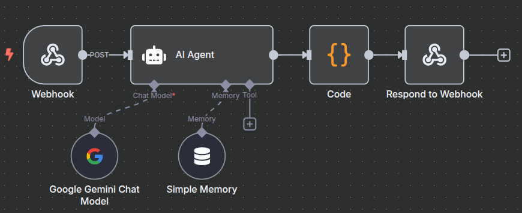
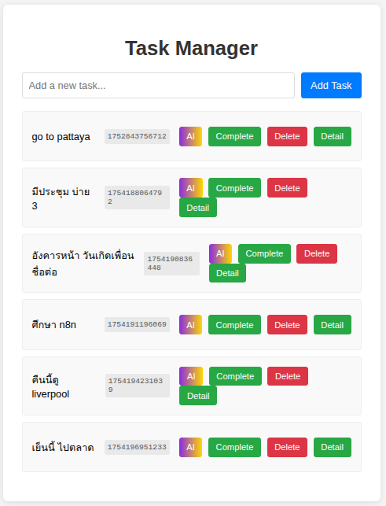
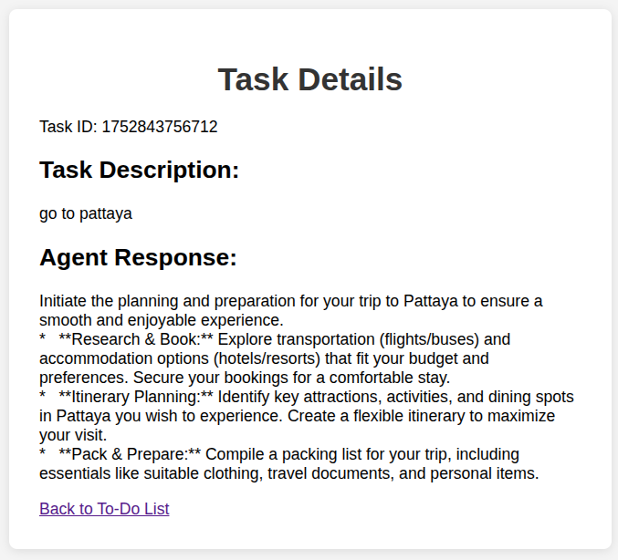
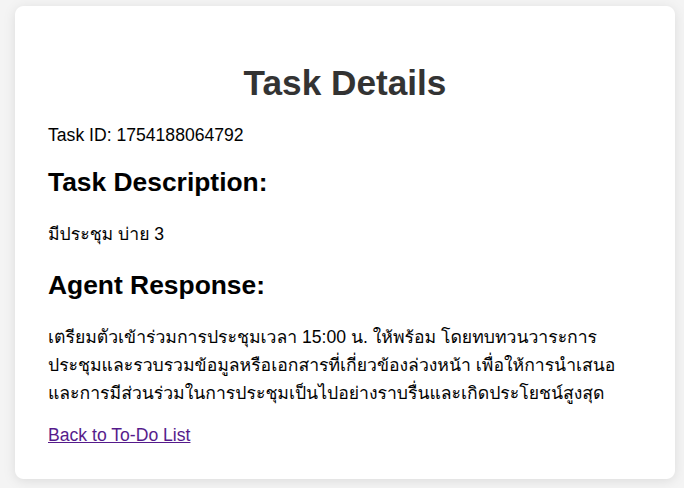
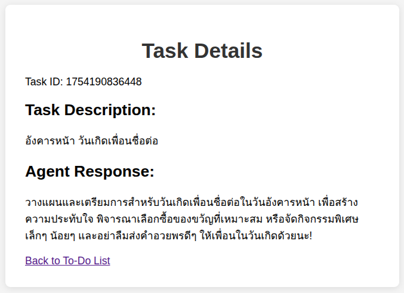
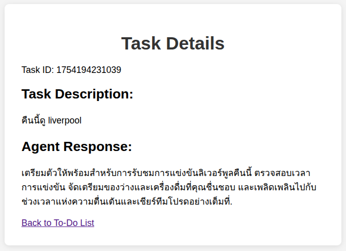

# ซอร์สโค้ดนี้ ใช้สำหรับเป็นตัวอย่างเท่านั้น ถ้านำไปใช้งานจริง ผู้ใช้ต้องจัดการเรื่องความปลอดภัย และ ประสิทธิภาพด้วยตัวเอง

# Smart To-Do List Butler

This project is a "Smart To-Do List Butler," an intelligent task management application that goes beyond a standard to-do list. It uses an AI-powered butler, built with n8n and Google Gemini, to take your simple, everyday tasks and transform them into well-defined, actionable items.



## Features

- **Simple & Clean UI**: A straightforward and intuitive interface for managing your tasks.
- **Standard Task Management**: Add, complete, and delete tasks with ease.
- **AI-Powered Task Perfection**: A special "AI" button sends your task to an intelligent agent that elaborates on it, suggesting concrete steps, and making it more specific and actionable.
- **Detailed Task View**: See both your original task and the AI-enhanced version on a dedicated details page.
- **Node.js Backend**: A simple and efficient Express.js server to handle task operations.
- **n8n Automation**: The core AI logic is powered by a flexible n8n workflow, making it easy to customize and extend.

## Screenshots

| Task List | Pattaya Task | Meeting Task |
|---|---|---|
|  |  |  |
| **Birthday Task** | **Liverpool Task** |
|  |  |

## How It Works

The application consists of three main parts: a frontend, a backend server, and an n8n workflow.

1.  **Frontend (`src/`)**: The user interacts with a simple web interface to manage tasks. When a user wants to enhance a task, they click the "AI" button.
2.  **Backend (`server/`)**: The frontend communicates with a Node.js/Express server. This server handles the basic CRUD operations for tasks. When the "AI" button is clicked, the server forwards the task to an n8n webhook.
3.  **n8n Workflow (`Smart To-Do List Butler.json`)**:
    *   A **Webhook** node catches the task data from the backend.
    *   An **AI Agent** node, using a predefined prompt, instructs the Google Gemini model on how to "perfect" the task.
    *   The **Google Gemini Chat Model** processes the request and returns an elaborated, structured task.
    *   A **Code** node cleans up the AI's JSON output.
    *   The **Respond to Webhook** node sends the perfected task back to the backend, which then saves it.
    *   The user is redirected to a details page to see the result.

## Getting Started

### Prerequisites

-   **Node.js & npm**: [Download & Install Node.js](https://nodejs.org/)
-   **n8n**: A running instance of n8n (either [self-hosted](https://docs.n8n.io/hosting/installation/) or on [n8n.cloud](https://n8n.cloud/)).
-   **Google Gemini API Key**: You'll need an API key from [Google AI Studio](https://aistudio.google.com/).

### Installation & Setup

1.  **Clone the Repository**
    ```bash
    git clone <repository-url>
    cd <repository-directory>
    ```

2.  **Install Dependencies**
    ```bash
    npm install
    ```

3.  **Configure the n8n Workflow**
    *   Open your n8n instance.
    *   Create the workflow.
    *   In the workflow, select the **Google Gemini Chat Model** node.
    *   Create new credentials and add your Google Gemini API key.
    *   **Activate** the workflow.

4.  **Run the Application**
    *   Start the backend server:
        ```bash
        npm start
        ```
    *   Open your browser and navigate to `http://localhost:3000`.

## File Structure

```
.
├── images/                 # Application screenshots
├── node_modules/           # Project dependencies
├── server/
│   ├── agent-response.json # Stores AI-generated responses
│   ├── data.json           # Stores the user's tasks
│   └── index.js            # The Node.js/Express backend server
├── src/
│   ├── index.html          # Main to-do list page
│   ├── script.js           # Frontend logic for the main page
│   ├── style.css           # CSS styles
│   └── task.html           # Task details page
├── .gitignore
├── nodemon.json            # Configuration for nodemon
├── package-lock.json
├── package.json
├── README.md               # This file
```
